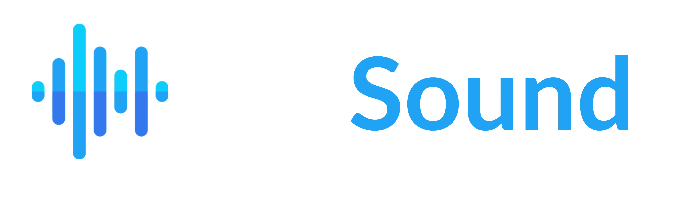

<a name="readme-top"></a>

<div align="center">
  <br/>
  
  <br/>
</div>

<!-- TABLE OF CONTENTS -->

# 📗 Table of Contents

- [📖 About the Project](#about-project)
  - [🛠 Built With](#built-with)
    - [Tech Stack](#tech-stack)
    - [Key Features](#key-features)
  - [🚀 Live Demo](#live-demo)
  - [🎥 App Video Presentation ](#video-demo)
- [💻 Getting Started](#getting-started)
  - [Prerequisites](#prerequisites)
  - [Setup](#setup)
  - [Install](#install)
  - [Usage](#usage)
  - [Run tests](#run-tests)
  - [Deployment](#deployment)
- [👥 Authors](#authors)
- [🔭 Future Features](#future-features)
- [🤝 Contributing](#contributing)
- [⭐️ Show your support](#support)
- [🙏 Acknowledgements](#acknowledgements)
- [📝 License](#license)

<!-- PROJECT DESCRIPTION -->

# 📖 [thatSound] <a name="about-project"></a>

**[thatSound]** is a powerful React and Redux application that revolutionizes the way you discover, explore, and download sound samples. It provides a seamless user experience for musicians, producers, and sound enthusiasts by offering a vast collection of high-quality sound samples from various genres and instruments.

## 🛠 Built With <a name="built-with"></a>

### Tech Stack <a name="tech-stack"></a>

<details>
  <summary>Client</summary>
  <ul>
    <li><a href="https://reactjs.org/">React.js: JavaScript library for building user interfaces.</a></li>
    <li><a href="https://react-redux.js.org/">Redux.j: State management library for managing global application state.</a></li>
    <li>HTML: Markup language for creating the structure of web pages.</li>
    <li>CSS: Styling language for designing the visual presentation of web pages.</li>
    <li>JavaScript: Programming language for implementing interactive functionality.</li>
  </ul>
</details>

<details>
  <summary>Server</summary>
  <ul>
    <li><a href="https://freesound.org/docs/api/overview.html">Free Sound API</a></li>
  </ul>
</details>

<!-- Features -->

### Key Features <a name="key-features"></a>

- **Extensive Sound Library**: Access a meticulously curated collection of high-quality sound samples spanning various genres, instruments, atmospheres, and moods.
- **Advanced Search and Filtering**: Effortlessly find the perfect sound sample using advanced search filters, tags, and categories such as genre, mood, instrument, and more.
- **Seamlessly Download and Save**: Conveniently download and save your selected sound samples to your device or cloud storage for easy access and integration into your projects.
- **Intuitive User Interface**: Enjoy a seamless user experience with a clean, intuitive, and responsive user interface that is easy to navigate and use.

<p align="right">(<a href="#readme-top">back to top</a>)</p>

<!-- LIVE DEMO -->

## 🚀 Live Demo <a name="live-demo"></a>

- [Live Demo Link](https://thatsound.netlify.app/)

<p align="right">(<a href="#readme-top">back to top</a>)</p>

<!-- VIDEO PRESENTATION -->

## 🎥 App Video Presentation <a name="video-demo"></a>
[App video presentation](https://www.loom.com/share/e51adb83d815490fac36aa2b83247795?sid=625f0874-b00a-4a17-accd-ab6b88de6d6a)

<p align="right">(<a href="#readme-top">back to top</a>)</p>

<!-- GETTING STARTED -->

## 💻 Getting Started <a name="getting-started"></a>

To get a local copy up and running, follow these steps.


### Prerequisites
Ensure that you have Node.js installed on your machine.

### Installation
Clone the repository to your local machine and navigate to the project directory.

```shell
git clone https://github.com/your-username/thatSound.git
cd thatSound
```

### Dependencies
Install the necessary dependencies using npm.

```shell
npm install
```

### Development
Start the development server and open the application in your browser.

```shell
npm start
```

### Production
Build the optimized production-ready bundle.

```shell
npm run build
```

### Usage

To run the project, execute the following command:

```shell
npm start
```

### Run tests

To run tests, run the following command:

```shell
npm run test
```

<p align="right">(<a href="#readme-top">back to top</a>)</p>

<!-- AUTHORS -->

## 👥 Authors <a name="authors"></a>

👤 **Jorge Camargo**

- GitHub: [@jicamargo](https://github.com/jicamargo)
- Twitter: [@ji_camargo](https://twitter.com/ji_camargo)
- LinkedIn: [LinkedIn](https://linkedin.com/in/jorgecamargog)

  _Feel free to reach out to me if you have any questions or collaboration opportunities!_

<p align="right">(<a href="#readme-top">back to top</a>)</p>

<!-- FUTURE FEATURES -->

## 🔭 Future Features <a name="future-features"></a>

- [ ] **User Accounts:** Create a user account to save your favorite sound samples, comment and rate samples.


<p align="right">(<a href="#readme-top">back to top</a>)</p>

<!-- CONTRIBUTING -->

## 🤝 Contributing <a name="contributing"></a>

Contributions, issues, and feature requests are welcome!

Feel free to check the [issues page](../../issues/).

<p align="right">(<a href="#readme-top">back to top</a>)</p>

<!-- SUPPORT -->

## ⭐️ Show your support <a name="support"></a>

If you like this project, please give it a ⭐️. Thank you!

<p align="right">(<a href="#readme-top">back to top</a>)</p>

<!-- ACKNOWLEDGEMENTS -->

## 🙏 Acknowledgments <a name="acknowledgements"></a>

- I would like to thank:
  - [Microverse team](https://microverse.org/) for this learning opportunity.
  - [Nelson Sakwa on Behance](https://www.behance.net/sakwadesignstudio) for the original design idea.
  - [FreeSound API](https://freesound.org/docs/api/overview.html) for their fantastic database and its API.
  - [Unsplash](https://unsplash.com/) for the royalty-free images.
  - [FlatIcon](https://www.flaticon.com/) for the royalty-free icons.


<p align="right">(<a href="#readme-top">back to top</a>)</p>

<!-- LICENSE -->

## 📝 License <a name="license"></a>

This project is [MIT](./LICENSE) licensed.

<p align="right">(<a href="#readme-top">back to top</a>)</p>